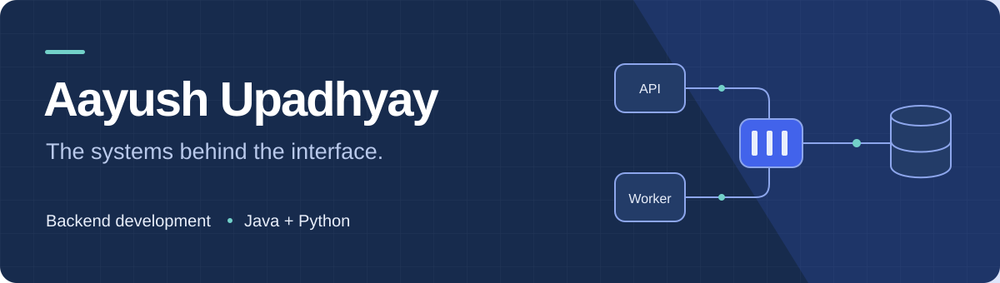

# Hi, I'm Aayush.

I'm a computer science graduate focused on **backend development**. I build projects with Java, Python, and PostgreSQL, and I'm especially interested in what happens behind an API: how work is queued, how data is stored, and how failures are handled.

**Looking for entry-level software engineering and backend roles.** Based in Patna, India.

[LinkedIn](https://www.linkedin.com/in/aayush-upadhyay-63bb3a27b/) &nbsp; / &nbsp; [Email me](mailto:aayushupadhyay025@gmail.com) &nbsp; / &nbsp; [Explore my repositories](https://github.com/Aayush-25?tab=repositories)

## Selected projects

### [JobFlowQ](https://github.com/Aayush-25/jobflowq)
A job queue built around PostgreSQL workers, with Kafka events for tracking job state changes.

- Workers claim jobs using `FOR UPDATE SKIP LOCKED`.
- Failed jobs retry up to a configured limit, then enter a `DEAD` state.
- A REST API, queue metrics, and Docker Compose bring the pieces together.

**Java 17 · Spring Boot · PostgreSQL · Kafka · Docker**

[Explore the code](https://github.com/Aayush-25/jobflowq) · [Architecture and setup](https://github.com/Aayush-25/jobflowq#architecture)

---

### [EvalOps](https://github.com/Aayush-25/evalops)
A Python toolkit for capturing LLM traces and inspecting evaluation results.

- A tracing SDK sends requests to a FastAPI backend.
- PostgreSQL stores traces; a Streamlit dashboard helps explore them.
- RAGAS evaluates faithfulness and answer relevancy.

**Python · FastAPI · PostgreSQL · Streamlit · pytest**

[Explore the code](https://github.com/Aayush-25/evalops) · [SDK usage and setup](https://github.com/Aayush-25/evalops#sdk-usage)

---

### [NEXUS](https://github.com/Aayush-25/Nexus)
A document-based study assistant with retrieval and streamed answers.

- FAISS retrieves relevant document content for the answer pipeline.
- Flask serves the API and streams responses to the chat interface.
- Review reminders and a topic tracker support study sessions.

**Python · Flask · FAISS · LangChain · JavaScript**

[Explore the code](https://github.com/Aayush-25/Nexus) · [API and setup](https://github.com/Aayush-25/Nexus#backend-api-routes)

## My toolkit

| Area | Technologies used in my projects |
| :--- | :--- |
| Languages | Java, Python, SQL |
| Backend | Spring Boot, FastAPI, Flask, REST APIs |
| Data & messaging | PostgreSQL, Kafka, FAISS |
| Testing & tools | JUnit, pytest, Git, Docker Compose |

**Currently strengthening:** Java and Spring Boot fundamentals, data structures, and database design.

## A little activity, a little personality

<picture>
  <source media="(prefers-color-scheme: dark)" srcset="https://raw.githubusercontent.com/Aayush-25/Aayush-25/output/github-contribution-grid-snake-dark.svg" />
  <source media="(prefers-color-scheme: light)" srcset="https://raw.githubusercontent.com/Aayush-25/Aayush-25/output/github-contribution-grid-snake.svg" />
  
</picture>

Take a break: play tic-tac-toe

You play ❌; the bot plays 🤖. Choose an empty cell and submit the GitHub issue to make your move. The board is shared with other visitors.

<!-- TICTACTOE-BOARD-START -->
| | 0 | 1 | 2 |
|---|---|---|---|
| **0** | [⬜](https://github.com/Aayush-25/Aayush-25/issues/new?title=ttt:0,0&body=make+move) | [⬜](https://github.com/Aayush-25/Aayush-25/issues/new?title=ttt:0,1&body=make+move) | [⬜](https://github.com/Aayush-25/Aayush-25/issues/new?title=ttt:0,2&body=make+move) |
| **1** | [⬜](https://github.com/Aayush-25/Aayush-25/issues/new?title=ttt:1,0&body=make+move) | [⬜](https://github.com/Aayush-25/Aayush-25/issues/new?title=ttt:1,1&body=make+move) | [⬜](https://github.com/Aayush-25/Aayush-25/issues/new?title=ttt:1,2&body=make+move) |
| **2** | [⬜](https://github.com/Aayush-25/Aayush-25/issues/new?title=ttt:2,0&body=make+move) | [⬜](https://github.com/Aayush-25/Aayush-25/issues/new?title=ttt:2,1&body=make+move) | [⬜](https://github.com/Aayush-25/Aayush-25/issues/new?title=ttt:2,2&body=make+move) |
<!-- TICTACTOE-BOARD-END -->

See my contribution landscape

<picture>
  <source media="(prefers-color-scheme: dark)" srcset="https://raw.githubusercontent.com/Aayush-25/Aayush-25/main/profile-3d-contrib/profile-night-rainbow.svg" />
  <source media="(prefers-color-scheme: light)" srcset="https://raw.githubusercontent.com/Aayush-25/Aayush-25/main/profile-3d-contrib/profile-south-season-animate.svg" />
  
</picture>

---

Interested in my work? [Let's connect on LinkedIn](https://www.linkedin.com/in/aayush-upadhyay-63bb3a27b/) or [send me an email](mailto:aayushupadhyay025@gmail.com).
